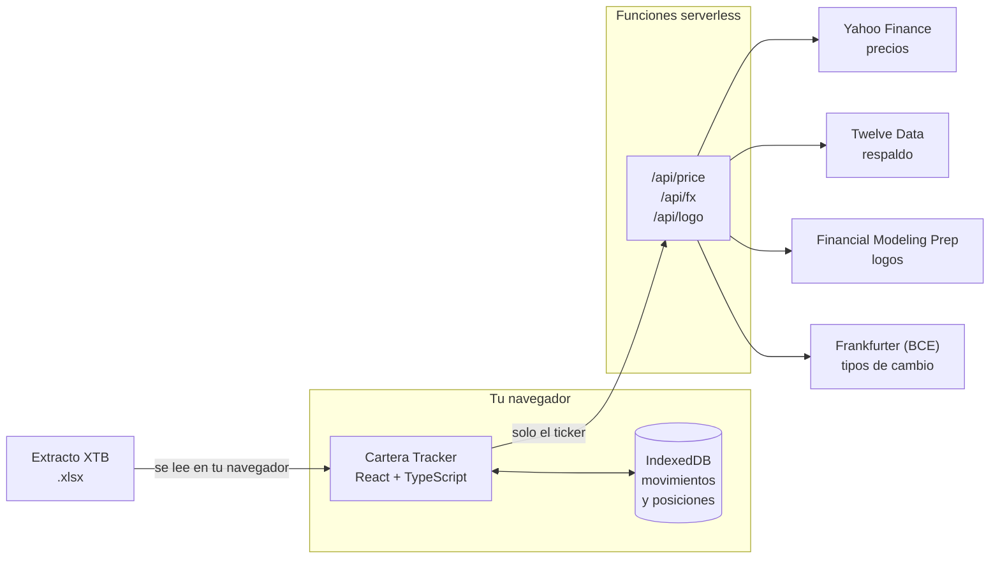

<div align="center">


# Cartera Tracker

**Tu cartera de XTB, con precios en vivo y sin ceder tus datos a nadie.**

Importas el extracto `.xlsx` que exporta XTB y obtienes posiciones, cotizaciones
al día, plusvalías y rentabilidad anualizada. Todo se queda en tu dispositivo.

[Abrir la app](https://carter-ia.vercel.app) · [Qué hace](#qué-hace) · [Cómo funciona](#cómo-funciona) · [Empezar](#empezar)

</div>

---

## Qué hace

Un extracto de XTB es una hoja de cálculo con cientos de apuntes de caja: compras,
ventas, dividendos, retenciones, comisiones e ingresos. Útil para Hacienda,
inservible para responder «¿cómo va mi cartera?». Esto lo convierte en eso otro.

| | |
|---|---|
| 📥 **Importación** | Lee las hojas `Cash Operations` y `Closed Positions`. Reimportar el mismo extracto no duplica nada: cada apunte se identifica por un hash estable de su contenido. |
| 📈 **Precios en vivo** | Cotización actual de cada valor, convertida a euros, con el nombre y el logo de la empresa. |
| 🔥 **Volatilidad del día** | Los seis valores que más se mueven hoy, y la variación de toda la cartera respecto al cierre de ayer. |
| 💰 **Plusvalías** | Latentes (lo que aún no has vendido) y realizadas (lo que ya vendiste), cada una medida sobre su propio coste. |
| 📊 **Rentabilidad real** | XIRR: rentabilidad anualizada que tiene en cuenta *cuándo* entró cada euro, no solo cuánto. |
| 🗂️ **Histórico** | Plusvalías realizadas por año → por valor → operación a operación. |
| 🥧 **Distribución** | Reparto de la cartera por posición. |
| 🧾 **Informe de caja** | Dividendos, intereses, comisiones e impuestos acumulados. |
| 📱 **Instalable** | Es una PWA: se instala en el móvil como una app más y funciona sin conexión con los últimos datos descargados. |

## Tus datos son tuyos

No hay cuenta que crear, ni servidor que guarde nada, ni analítica.

Tu extracto **nunca sale del navegador**: se procesa en tu dispositivo y se guarda
en su base de datos local (IndexedDB). El servidor solo actúa de intermediario para
preguntar cotizaciones, y en esas peticiones únicamente viaja el ticker —
nunca cuántas acciones tienes ni cuánto vale tu cartera.

El botón **Borrar todo** vacía tus datos de ese dispositivo cuando quieras.

## Cómo funciona



### Por qué hacen falta las funciones serverless

Ninguno de los proveedores de datos permite que un navegador les llame
directamente (no envían cabeceras CORS). Las funciones de `api/` son un
intermediario mínimo que además mantiene la clave de API en el servidor, fuera
del código que se descarga el navegador.

### Cadena de respaldo

Cada dato tiene una alternativa, porque los proveedores gratuitos fallan:

- **Precios**: Yahoo Finance → Twelve Data → última cotización guardada.
  Yahoo va primero porque no tiene cuota; Twelve Data limita a 800 consultas
  diarias, que con una cartera de 27 posiciones se agotan en unas 29
  actualizaciones.
- **Logos**: Financial Modeling Prep → Twelve Data. Se resuelve **una sola vez por
  valor** y se guarda: los logos no cambian, y así no se gasta cuota en cada visita.
- **Tipos de cambio**: Frankfurter (datos del BCE), cacheados una hora.

### De ticker de XTB a ticker de proveedor

XTB nombra los valores a su manera (`AMZN.DE`), y cada proveedor a la suya
(`AMZ.DE` en Yahoo). La conversión es por regla de sufijo de mercado —
**US, DE, UK, SE, DK, FR, IT**— más una tabla de excepciones para los casos que
no siguen la regla, como las clases de acción (`NOVOB.DK` → `NOVO-B.CO`).

### Detalles que cuestan más de lo que parece

- **Peniques.** Las plazas de Londres cotizan en peniques (`GBp`), no en libras.
  Sin normalizar, un valor aparecería con un precio 100 veces mayor.
- **Mercados que aún no han abierto.** Por la mañana, la bolsa estadounidense
  todavía no ha cotizado y su «precio actual» sigue siendo el cierre de ayer.
  Esos valores se excluyen del panel de volatilidad para no mezclar la variación
  de hoy con la de ayer.
- **XIRR que no converge.** El cálculo es iterativo y con ciertos patrones de
  aportaciones no llega a una solución. Cuando pasa, se recurre al método Dietz
  modificado —fórmula cerrada, no puede fallar— y la cifra se marca como
  aproximada en vez de desaparecer.
- **Coste medio ponderado.** Vender parte de una posición no altera el coste medio
  de lo que queda, solo la cantidad.

## Empezar

```bash
git clone https://github.com/jsimonsanchez/CarterIA.git
cd CarterIA
npm install
npm run dev
```

Abre <http://localhost:5173> y pulsa **Importar extracto de XTB**.

> **Nota:** las rutas de `api/` son funciones de Vercel y no se ejecutan con
> `npm run dev`, así que en local no habrá precios ni logos. Para probarlas,
> usa `vercel dev` o despliega.

### Clave de API (opcional)

Todo funciona sin ninguna clave: los precios los sirve Yahoo y los logos FMP.
Twelve Data solo entra como respaldo, y para eso hace falta una clave gratuita
de [twelvedata.com](https://twelvedata.com/):

```bash
cp .env.example .env
```

En Vercel, la misma variable **sin** el prefijo `VITE_`, para que se quede en el
servidor y no acabe en el código del navegador.

## Comandos

| Comando | Qué hace |
|---|---|
| `npm run dev` | Servidor de desarrollo |
| `npm run build` | Comprobación de tipos y compilación de producción |
| `npm test` | Pruebas de la lógica financiera |
| `npm run lint` | Oxlint |

## Estructura

```
api/            Funciones serverless (precios, tipos de cambio, logos)
src/
  components/   Interfaz
  domain/       Lógica pura y comprobable: posiciones, XIRR, rendimiento
  import/       Lectura del .xlsx de XTB
  prices/       Cotizaciones y conversión a euros
  db/           Esquema de IndexedDB (Dexie)
scripts/        Utilidades: validar una importación, generar datos de prueba,
                comprobar el mapeo de símbolos, generar los iconos
design/         SVG original del icono
```

Las pruebas viven junto al código que comprueban (`xirr.test.ts` al lado de
`xirr.ts`) y se ejecutan con el runner nativo de Node, sin dependencias extra.

## Bajo el capó

React 19 · TypeScript · Vite · Dexie (IndexedDB) · ExcelJS · Recharts ·
vite-plugin-pwa · Funciones Edge de Vercel

## Descargo

Proyecto personal, sin relación con XTB. Las cifras son orientativas y dependen
de datos de terceros: no las uses para tu declaración de impuestos sin
contrastarlas con los documentos oficiales de tu bróker.
